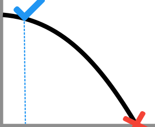

<div align="center">
  <br>
</div>

# RUL-PM
-----------------


# RUL-PM: python Remaining Useful Life estimation toolkit

[](https://coveralls.io/github/lucianolorenti/rul_pm?branch=main)
[](https://lucianolorenti.github.io/rul_pm/)

## What is it?

**RUL-PM** is a Python package that provides a flexible environment designed to make working with predictive maintenance task both easy and intuitive. (Yes, I stole that from pandas readme)

## Main Features

* PM dataset handling
* Feature extraction in a live-wise approach
* Model fitting for RUL regression on PM datasets.
* Model evaluation and comparison through metrics and plots

## Where to get it
The source code is currently hosted on GitHub at:
https://github.com/lucianolorenti/rul_pm

```sh
git clone https://github.com/lucianolorenti/rul_pm
pip install [-e] rul_pm
```

 Made with <3 @   <a href="https://www.dei.unipd.it/">  
         
      </a>
